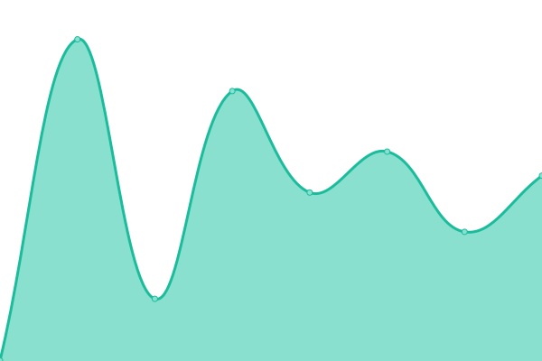

# Due to upptime is not very useful to TomsProject, we wont use it as next status page.

# [📈 Live Status](https://tp-uptime.vercel.app): <!--live status--> **🟩 All systems operational**

This repository contains the open-source uptime monitor and status page for [TomsProject](https://www.projectoms.com/), powered by [Upptime](https://github.com/upptime/upptime).

With [Upptime](https://upptime.js.org), you can get your own unlimited and free uptime monitor and status page, powered entirely by a GitHub repository. We use [Issues](https://github.com/TomsProject/uptime/issues) as incident reports, [Actions](https://github.com/TomsProject/uptime/actions) as uptime monitors, and [Pages](https://tp-uptime.vercel.app) for the status page.

<!--start: status pages-->
<!-- This summary is generated by Upptime (https://github.com/upptime/upptime) -->
<!-- Do not edit this manually, your changes will be overwritten -->
<!-- prettier-ignore -->
| URL | Status | History | Response Time | Uptime |
| --- | ------ | ------- | ------------- | ------ |
|  [TP Main](https://www.projectoms.com/pc/) | 🟩 Up | [tp-main.yml](https://github.com/xprc/uptime/commits/HEAD/history/tp-main.yml) | 

 306ms
     
 | 

<a href="https://tp-uptime.vercel.app/history/tp-main">99.68%</a>
    

|  [TP Blog](https://blog.projectoms.com/) | 🟩 Up | [tp-blog.yml](https://github.com/xprc/uptime/commits/HEAD/history/tp-blog.yml) | 

 324ms
     
 | 

<a href="https://tp-uptime.vercel.app/history/tp-blog">99.68%</a>
    

|  [TP.JE](https://tp.je/) | 🟩 Up | [tp-je.yml](https://github.com/xprc/uptime/commits/HEAD/history/tp-je.yml) | 

 243ms
     
 | 

<a href="https://tp-uptime.vercel.app/history/tp-je">100.00%</a>
    

|  [VTP.XYZ](https://vtp.xyz/) | 🟩 Up | [vtp-xyz.yml](https://github.com/xprc/uptime/commits/HEAD/history/vtp-xyz.yml) | 

 197ms
     
 | 

<a href="https://tp-uptime.vercel.app/history/vtp-xyz">99.68%</a>
    

|  [TP API 1](https://api.projectoms.com/time) | 🟩 Up | [tp-api-1.yml](https://github.com/xprc/uptime/commits/HEAD/history/tp-api-1.yml) | 

 1107ms
     
 | 

<a href="https://tp-uptime.vercel.app/history/tp-api-1">99.68%</a>
    

|  [TP API 2](https://api1.projectoms.com/time) | 🟩 Up | [tp-api-2.yml](https://github.com/xprc/uptime/commits/HEAD/history/tp-api-2.yml) | 

 929ms
     
 | 

<a href="https://tp-uptime.vercel.app/history/tp-api-2">99.68%</a>
    

|  [TP Assets](https://assets.projectoms.com/) | 🟩 Up | [tp-assets.yml](https://github.com/xprc/uptime/commits/HEAD/history/tp-assets.yml) | 

 612ms
     
 | 

<a href="https://tp-uptime.vercel.app/history/tp-assets">100.00%</a>
    

|  [TP Avatar](https://avatar.projectoms.com/) | 🟩 Up | [tp-avatar.yml](https://github.com/xprc/uptime/commits/HEAD/history/tp-avatar.yml) | 

 340ms
     
 | 

<a href="https://tp-uptime.vercel.app/history/tp-avatar">100.00%</a>
    

|  [TP Media](https://media.projectoms.com/) | 🟩 Up | [tp-media.yml](https://github.com/xprc/uptime/commits/HEAD/history/tp-media.yml) | 

 304ms
     
 | 

<a href="https://tp-uptime.vercel.app/history/tp-media">100.00%</a>
    

|  [CKCode](https://www.ckbctc.com/) | 🟩 Up | [ck-code.yml](https://github.com/xprc/uptime/commits/HEAD/history/ck-code.yml) | 

 336ms
     
 | 

<a href="https://tp-uptime.vercel.app/history/ck-code">99.68%</a>
    

|  [TP Test](https://test.projectoms.com/) | 🟩 Up | [tp-test.yml](https://github.com/xprc/uptime/commits/HEAD/history/tp-test.yml) | 

 305ms
     
 | 

<a href="https://tp-uptime.vercel.app/history/tp-test">99.68%</a>
    

|  [TPCloud](https://cloud.tp.je/) | 🟩 Up | [tp-cloud.yml](https://github.com/xprc/uptime/commits/HEAD/history/tp-cloud.yml) | 

 213ms
     
 | 

<a href="https://tp-uptime.vercel.app/history/tp-cloud">100.00%</a>
    

|  [TP Short Link](https://s.tp.je/) | 🟩 Up | [tp-short-link.yml](https://github.com/xprc/uptime/commits/HEAD/history/tp-short-link.yml) | 

 156ms
     
 | 

<a href="https://tp-uptime.vercel.app/history/tp-short-link">100.00%</a>
    

|  [GitHub](https://github.com/) | 🟩 Up | [git-hub.yml](https://github.com/xprc/uptime/commits/HEAD/history/git-hub.yml) | 

 195ms
     
 | 

<a href="https://tp-uptime.vercel.app/history/git-hub">100.00%</a>
    

|  [Google](https://www.google.com/) | 🟩 Up | [google.yml](https://github.com/xprc/uptime/commits/HEAD/history/google.yml) | 

 103ms
     
 | 

<a href="https://tp-uptime.vercel.app/history/google">100.00%</a>
    

|  [Facebook](https://www.facebook.com/) | 🟩 Up | [facebook.yml](https://github.com/xprc/uptime/commits/HEAD/history/facebook.yml) | 

 232ms
     
 | 

<a href="https://tp-uptime.vercel.app/history/facebook">100.00%</a>
    

|  [Baidu](https://www.baidu.com/) | 🟩 Up | [baidu.yml](https://github.com/xprc/uptime/commits/HEAD/history/baidu.yml) | 

 3676ms
     
 | 

<a href="https://tp-uptime.vercel.app/history/baidu">100.00%</a>
    

|  [Tencent](https://www.qq.com/) | 🟩 Up | [tencent.yml](https://github.com/xprc/uptime/commits/HEAD/history/tencent.yml) | 

 331ms
     
 | 

<a href="https://tp-uptime.vercel.app/history/tencent">99.77%</a>
    

|  [Wikipedia](https://en.wikipedia.org) | 🟩 Up | [wikipedia.yml](https://github.com/xprc/uptime/commits/HEAD/history/wikipedia.yml) | 

 277ms
     
 | 

<a href="https://tp-uptime.vercel.app/history/wikipedia">100.00%</a>
    

<!--end: status pages-->

[**Visit our status website →**](https://tp-uptime.vercel.app)

## 📄 License

- Powered by: [Upptime](https://github.com/upptime/upptime)
- Code: [MIT](./LICENSE) © [TomsProject](https://www.projectoms.com/)
- Data in the `./history` directory: [Open Database License](https://opendatacommons.org/licenses/odbl/1-0/)
